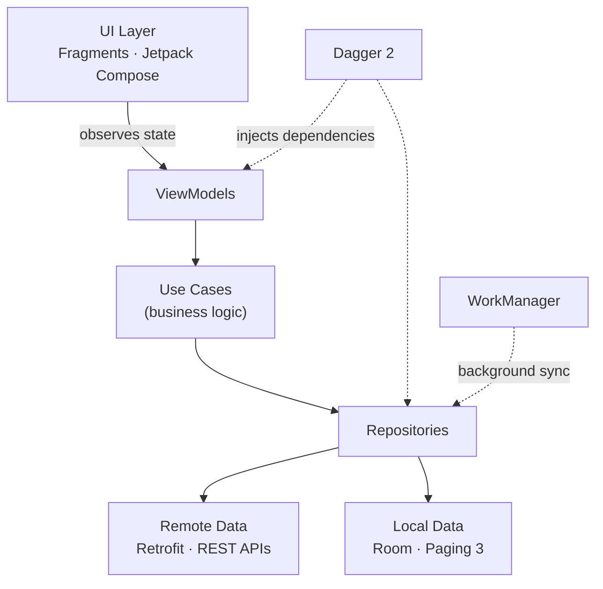

# Autoverse Spares

### B2B Auto Spare Parts & Workshop Management App for Garages

> [!NOTE]
> This is a **commercial production application** I develop professionally. The source code is proprietary and confidential, so this repository is a **project showcase only** — it contains no source code, credentials, or customer data.

---

## Table of Contents

- [About the Project](#about-the-project)
- [Highlights](#highlights)
- [Key Features](#key-features)
- [Tech Stack](#tech-stack)
- [Architecture](#architecture)
- [Engineering Practices](#engineering-practices)
- [My Role & Contributions](#my-role--contributions)
- [Contact](#contact)

---

## About the Project

**Autoverse Spares** is a B2B Android application that helps independent car garages and workshops across India **source genuine spare parts quickly and run their workshop digitally**.

Garages typically lose time calling multiple suppliers to find the right part for a vehicle. The app solves this by letting mechanics identify the exact part for a car, compare options, order with fast delivery, and manage the complete service workflow — from vehicle check-in to customer quotation and payment — in one place.

The platform is also available as a **web application built with Angular**, which I developed alongside the Android app — sharing the same REST APIs and keeping product discovery, cart and order workflows consistent across both.

➡️ See the web app: **[autoverse-spares-web-showcase](https://github.com/harshithauv/autoverse-spares-web-showcase)**

---

## Highlights

| | |
|---|---|
| 🚀 **In production since 2022** | Live on Google Play and actively used by garages |
| 📦 **50+ releases** | Continuous delivery through staging and production tracks |
| 🧩 **40+ feature modules** | Large, modular codebase of ~1,100 source files |
| 🔧 **End-to-end ownership** | From requirements to release and production support |

---

## Key Features

### 🔍 Parts Discovery
- **Vehicle-based lookup** — select make → model → variant → year, or simply enter the vehicle registration number
- **Smart search** with suggestions, filters (brand, category, vehicle) and sorting
- **Scan to search** — camera-based capture with on-device text recognition (Google ML Kit)
- Browse by **brand and category**, plus curated **service kits** and **clutch kits**

### 🛒 Ordering & Payments
- Cart, wishlist and part requests for items not in the catalogue
- Secure **in-app payments** via Razorpay
- **Order tracking** with live delivery status, ratings and returns
- Delivery location selection with Google Maps

### 🧾 Workshop Management
- **Digital job cards** — vehicle check-in reports and exterior inspection checklists
- **Customer quotations** — build, share and track quotes including labour charges
- **Customer payments** — generate and share payment links
- Service **bookings** and **employee management**

### 🎁 Engagement & Growth
- Wallet with **rewards and redemption**
- **Learning videos** for mechanics with multi-language support
- Push notifications and deep linking
- Embedded **business analytics dashboards** for garage owners

---

## Tech Stack

| Category | Technologies |
|---|---|
| **Languages** | Kotlin, Java |
| **UI** | XML Views with ViewBinding & DataBinding, Jetpack Compose (Material 3), Lottie animations |
| **Navigation** | Jetpack Navigation Component with Safe Args |
| **Architecture** | MVVM, Clean Architecture principles (Use Cases, Repositories) |
| **Dependency Injection** | Dagger 2 |
| **Networking** | Retrofit, OkHttp, Gson (REST APIs) |
| **Asynchronous** | RxJava 2, Kotlin Coroutines, LiveData |
| **Persistence** | Room, Paging 3, EncryptedSharedPreferences |
| **Background Work** | WorkManager |
| **Camera & ML** | CameraX, Google ML Kit Text Recognition |
| **Maps & Location** | Google Maps SDK, Fused Location Provider |
| **Payments** | Razorpay |
| **Firebase** | Cloud Messaging, Crashlytics, Analytics, Performance Monitoring |
| **Analytics** | Mixpanel |
| **Image Loading** | Glide, Coil |
| **Build & Release** | Gradle, KSP, Product Flavors, R8/ProGuard, Android App Bundles |

---

## Architecture

The app follows **MVVM** with a layered, Clean-Architecture-inspired structure and a single-activity navigation model.

---

## Engineering Practices

- **Environment separation** — dedicated staging and production build flavors with isolated configuration
- **Secure configuration** — API keys and secrets kept out of source control and injected at build time
- **Release optimization** — R8 code shrinking, resource shrinking and App Bundle delivery
- **Production monitoring** — Crashlytics and Performance Monitoring to detect and resolve issues quickly
- **Offline-friendly** — local caching and paginated data loading for smooth performance on low-end devices and slow networks
- **Backward compatibility** — supports a wide range of Android versions used by garages across India

---

## My Role & Contributions

I handled the Android application **end-to-end**:

- **Requirement Analysis** — understood business requirements and translated them into app features
- **Feature Development** — designed and built UI and features using Kotlin and Java, and the Angular web version of the platform
- **API Integration** — integrated REST APIs with the application
- **Testing & Releases** — tested builds and managed staging and production releases on Google Play
- **Production Support** — debugged and resolved production issues to keep the app stable
- **Cross-functional Collaboration** — worked closely with backend, QA and product teams to deliver and maintain the application

---

## Contact

**Harshitha U V** — Software Engineer, Bengaluru

---

© Autoverse Mobility. All product rights belong to their respective owner. This repository is for portfolio purposes only.

